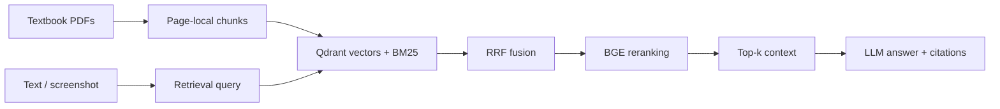

# Medical Textbook RAG

[](https://github.com/YhxMo/medical-rag/actions/workflows/tests.yml)
[简体中文](README.zh-CN.md) · [Architecture](docs/architecture.md) · [Evaluation](docs/evaluation.md) · [Experiments](experiments/README.md)

A textbook learning assistant with hybrid retrieval, screenshot questions, and source citations. Ask a question, retrieve relevant passages, and inspect the book name, PDF page, and evidence behind the answer.

## Architecture



- **Hybrid retrieval:** BGE ONNX embeddings, BM25, reciprocal rank fusion, and a BGE cross-encoder.
- **Traceable evidence:** source filenames, PDF pages, and character offsets survive ingestion and retrieval.
- **Screenshot input:** a vision model prepares the retrieval query and answers using the screenshot and textbook evidence. Chinese questions can be translated for the English corpus.
- **Optional figure indexing:** describe PDF pages containing raster images and store those descriptions alongside text.
- **One query service:** CLI, Gradio, and the offline demo share the same retrieval and answer pipeline.

## Quickstart

Python 3.12 and [uv](https://docs.astral.sh/uv/) are required.

```bash
uv sync --extra dev --locked

# Synthetic notes and deterministic embeddings: no model downloads or API calls
uv run python scripts/demo.py
uv run python scripts/demo.py --serve
```

The demo verifies the software flow. Its hash embeddings are not a semantic retrieval benchmark.

## Use your textbooks

```bash
cp config.example.yaml config.yaml
mkdir -p data/raw
# Add text-extractable PDFs to data/raw/

uv run medical-rag index
uv run medical-rag query 'What determines axial resolution in ultrasound?' --offline
uv run medical-rag serve
```

Embedding and reranker weights download on first use; local model paths can be configured instead. Qdrant runs locally without a server. Use one process per local index; stop the UI before rebuilding it.

Set `DEEPSEEK_API_KEY` in your shell for generated answers and `DASHSCOPE_API_KEY` for screenshot questions or figure indexing. Model names and compatible API endpoints are configurable. The UI starts in retrieval-only mode; uncheck that option to use a model.

```bash
uv run medical-rag query 'What determines axial resolution in ultrasound?'
uv run medical-rag query 'Explain this figure' --image /path/to/screenshot.png

# Optional: one vision API call per PDF page containing raster images
uv run medical-rag index --captions
```

Each `index` command replaces the configured index. A text-only rebuild removes previous figure descriptions. Paths inside YAML are relative to the config file; command-line image and dataset paths are relative to the working directory.

## Project layout

```text
src/
  document/       PDF loading, chunking, optional visual descriptions
  embedding/      FastEmbed and demo hash embeddings
  indexer/        Qdrant, BM25 and RRF
  reranker/       BGE cross-encoder
  application/    Dependency assembly, model client, prompts, query service
  evaluation/     Labelled retrieval metrics
  ui/             Gradio adapter
  config/         YAML and environment variables
  cli.py          index / query / serve / evaluate
  schema.py       Pages, evidence and retrieval hits
scripts/demo.py   Offline end-to-end demo
```

## Evaluation and tuning

[experiments/](experiments/README.md) preserves configurations, frozen datasets, per-question outputs, failures, and tuning decisions: hybrid baseline, chapter enrichment, BGE reranking, context expansion, and multimodal comparisons.

In a retrieval comparison on 10 labelled text questions, chapter enrichment with BGE reranking improved Recall@5 from 0.80 to 0.90 over the hybrid baseline, while P95 rose from 0.38 s to 1.85 s. This experiment illustrates the tradeoff between retrieval quality and latency. See the [original report](experiments/docs/resume-v2/retrieval_development.json) for configurations and measurement conditions.

## Validation

```bash
uv run pytest -q
uv run ruff check src tests scripts
uv run medical-rag evaluate /path/to/questions.json --output experiments/runs/baseline.json
```

Evaluation reports Recall@k, Precision@k, MRR, and NDCG@k. See the [dataset format and metric definitions](docs/evaluation.md).

This is a textbook learning tool, not a patient diagnosis system. Citation checks validate reference numbers, not semantic support. Text extraction is the default; optional visual descriptions cover pages with raster images, without a general OCR, vector-figure, or table reconstruction pipeline. Textbooks, model weights, indexes, and credentials are not distributed.
