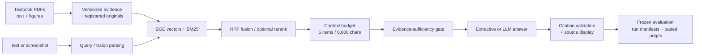

# Medical Imaging Textbook Learning Assistant

[](https://github.com/YhxMo/medical-rag/actions/workflows/tests.yml)


[](LICENSE)

[简体中文](README.zh-CN.md) · [Setup & experiments](docs/resume-v2/README.md) · [Verification status](docs/resume-v2/status.json)

A source-grounded RAG application for textbook learning: hybrid retrieval, document figures, screenshot questions, citations, and reproducible evaluation. **Not a patient-image diagnosis system.**

## Highlights

- **Corpus**: 2,809 text evidence records from three public textbooks (IAEA/MSF) + 60 real model-generated visual descriptions over registered figure pages; two isolated indexes (plain text / chapter-enhanced), 2,869 evidence records each, with book title and PDF page tracing.
- **Retrieval**: local BGE/ONNX embeddings + Qdrant + BM25 + RRF fusion, optional BGE cross-encoder reranking — strategy choice is frozen by a measured ablation, not by hype.
- **Evaluation integrity**: a frozen 80-task dataset (text / chart / screenshot / behavior × dev/holdout), input-hash run manifests that refuse cache reuse across changed inputs, paired A/B answers, two-round grading with explicit repair limits, and failures kept as-is.
- **Cost & ops**: a cross-process budget ledger with pre-call reservation (CNY 30 hard cap; 5.19 CNY conservatively accounted over 418 calls), content-addressed model-call cache, credential-free repo and resumable runs.
- **Honest boundaries**: AI-generated questions and AI proxy judges with human review count = 0; no clinical accuracy claims. Where a feature showed no reliable gain (original-image answering), it is **not** enabled by default.

## Architecture



## Measured results

Development-set retrieval selection (10 labelled text tasks, one warm pass, model init excluded — retrieval metrics, **not** answer accuracy):

| Strategy | Recall@5 | NDCG@5 | P95 |
|---|---:|---:|---:|
| Hybrid baseline | 0.80 | 0.706 | 0.38 s |
| Chapter-enhanced | 0.75 | 0.657 | 0.21 s |
| Chapter + BGE rerank (frozen default) | **0.90** | **0.755** | 1.85 s |

Contaminated 57-task regression set (old inspected questions, regression-only): hit 53/57 → 55/57 and NDCG@5 0.840 → 0.938 with reranking ([retrieval_regression.json](docs/resume-v2/retrieval_regression.json)). Offline single-query cold process ≈ 1.14 s.

Paired answer experiment (dev, 60 runs): strict proxy pass rates were text 1/10, captions 9/10, originals 7/10 — **original images showed no reliable gain**, which is why they stay off by default. Full accounting in the [improvement log](docs/evaluation/README.md) and [status](docs/resume-v2/status.json).

## Interface


*Gradio UI: text/screenshot questions, offline-only mode, cited excerpts with textbook breadcrumbs, collapsible original evidence and registered figure pages.*

## Quickstart

```bash
# 0) offline end-to-end demo — no API keys, no downloads
python scripts/offline_resume_demo.py

# 1) tests
python -m pytest -q -p no:cacheprovider --tb=short

# 2) build index + query + UI (needs source PDFs and local models, see setup guide)
python scripts/build_resume_v2.py --mode text
python -m src.cli query 'What determines axial resolution in ultrasound?' --config config.resume-v2.yaml --json
python -m src.cli serve --config config.resume-v2.yaml
```

Python 3.12; pinned dependencies in `docs/resume-v2/requirements.lock.txt`. Textbooks, model weights and generated datasets are **not** distributed in Git — a fresh checkout needs the setup guide to fetch public sources. Live multimodal answers need local `DEEPSEEK_API_KEY` / `DASHSCOPE_API_KEY` (entered without echo at runtime; never stored).

## Evaluation integrity

- 80 AI-generated, source-verified tasks are **frozen** (40 dev / 40 holdout, split by source-page and figure connectivity to prevent leakage).
- `run_manifest.json` freezes dataset / index / judge-prompt / selection hashes per output directory; changed inputs must use a new directory — old results are never overwritten.
- Grades come from model proxies plus a second-round source review that already caught judge false positives. Failed and incomplete runs are kept, not cleaned up.
- Screenshot inputs are textbook pages/figures, **not** patient CT/MRI studies. Image captions are model-generated descriptions, not joint image-text embeddings; no vision model was trained here.

## Roadmap

1. Versioned fix for the chapter-heading fallback defect (cross-chapter heading reuse), with fresh dev validation — current results stay labelled v1.
2. Human review pipeline for the frozen set (human-reviewed count is 0 today).
3. Product default vs experiment config split for image policy (changes are versioned, never retro-applied to finished runs).
4. Test coverage for UI streaming, Qwen-VL and OCR paths; single dependency lock at repo root.

## Docs

| Doc | Content |
|---|---|
| [docs/resume-v2/README.md](docs/resume-v2/README.md) | Setup, demo and full experiment workflow |
| [docs/evaluation/README.md](docs/evaluation/README.md) | Round-by-round improvement log (problem → change → measured effect) |
| [docs/resume-v2/status.json](docs/resume-v2/status.json) | Machine-readable verification status |
| [docs/resume-v2/HANDOFF.md](docs/resume-v2/HANDOFF.md) | Pause/resume record of the frozen experiment |
