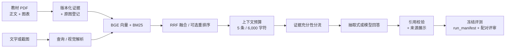

# 医学影像教材学习助手

[](https://github.com/YhxMo/medical-rag/actions/workflows/tests.yml)


[](LICENSE)

[English](README.md) · [安装、演示与完整实验流程](docs/resume-v2/README.md) · [验收状态](docs/resume-v2/status.json)

面向教材学习的来源可溯 RAG 应用：**混合检索、教材图文证据、截图提问、来源引用与可复现评测**。**不是患者影像诊断系统。**

## 亮点

- **语料**：3 份公开教材（IAEA/MSF）2,809 条文本证据 + 60 个图表页的真实视觉描述；原始／章节增强两套独立索引（各 2,869 条证据），书名与 PDF 页码可追溯。
- **检索**：本地 BGE/ONNX 向量 + Qdrant + BM25 + RRF 融合，可选 BGE 重排序——默认策略由实测消融冻结，不靠口号。
- **评测可信**：80 道冻结题集（text / chart / screenshot / behavior × 开发/留出）；`run_manifest` 按输入哈希拒绝跨输入复用缓存；配对对照、双轮评分（初评 + 限定修复 + 独立来源复核）；失败记录如实保留。
- **成本与运维**：跨进程费用预留账本（30 元硬上限，418 次调用保守累计 5.19 元）、内容寻址模型调用缓存、仓库零密钥、断点续跑。
- **诚实边界**：题目与评审均为 AI 生成／AI 代理，人工审核数为 0，不声称临床准确率；无可靠收益的能力（原图增强回答）**不**默认启用。

## 架构



## 实测结果

开发集检索选择（10 道标注文本题，预热后单次计时、不含模型初始化——检索指标，**不是**回答正确率）：

| 策略 | Recall@5 | NDCG@5 | P95 |
|---|---:|---:|---:|
| 混合基线 | 0.80 | 0.706 | 0.38 秒 |
| 章节增强 | 0.75 | 0.657 | 0.21 秒 |
| 章节 + BGE 重排序（冻结默认） | **0.90** | **0.755** | 1.85 秒 |

57 题旧回归集（含已检视旧题，仅作回归）：重排序使命中 53/57 → 55/57、NDCG@5 0.840 → 0.938（[retrieval_regression.json](docs/resume-v2/retrieval_regression.json)）。离线单次查询冷进程约 1.14 秒。

配对回答实验（开发集 60 次运行）：严格代理通过数为正文 1/10、视觉描述 9/10、原图 7/10——**原图尚无可靠收益**，因此默认不启用。完整口径见[改进与实验记录](docs/evaluation/README.md)与[验收状态](docs/resume-v2/status.json)。

## 界面


*Gradio 界面：文字／截图提问、仅本地模式、带教材标题路径的引用摘录、可展开原文证据与登记原图。*

## 快速使用

```bash
# 0) 离线端到端演示——无 API、无下载
python scripts/offline_resume_demo.py

# 1) 测试
python -m pytest -q -p no:cacheprovider --tb=short

# 2) 构建索引 / 查询 / 界面（需原文 PDF 与本地模型，见安装说明）
python scripts/build_resume_v2.py --mode text
python -m src.cli query 'What determines axial resolution in ultrasound?' --config config.resume-v2.yaml --json
python -m src.cli serve --config config.resume-v2.yaml
```

Python 3.12；依赖锁定见 `docs/resume-v2/requirements.lock.txt`。教材、模型权重与生成数据**不**随仓库分发，全新克隆需按安装说明获取公开来源。在线多模态需要本机提供 `DEEPSEEK_API_KEY` / `DASHSCOPE_API_KEY`（运行时无回显输入，不落盘）。

## 评测可信

- 80 道 AI 生成、来源核验题集**已冻结**（开发／留出各 40，按来源页与图像连通组划分，防泄漏）。
- `run_manifest.json` 按 dataset / index / judge-prompt / selection 哈希冻结每个输出目录；输入变化必须换新目录——旧结果永不覆盖。
- 评分来自模型代理 + 第二轮来源复核（复核已发现评委假阳性）；失败与未完成记录如实保留，不清理。
- 截图输入是教材页面／图表，**不是**患者 CT/MRI 影像；图注是模型生成描述而非图文联合嵌入，本项目未训练视觉模型。

## 改进方向

1. 章节标题回退缺陷（跨章节沿用）版本化修复 + 重新开发验证——现有结果保留为 v1。
2. 冻结题集的人工复核落地（当前人工审核数为 0）。
3. 图像策略的产品默认与实验配置分离（变更版本化，不追溯改写已完成运行）。
4. 补齐 UI 流式逻辑、Qwen-VL、OCR 路径测试；依赖文件统一到仓库根。

## 文档

| 文档 | 内容 |
|---|---|
| [docs/resume-v2/README.md](docs/resume-v2/README.md) | 安装、演示与完整实验流程 |
| [docs/evaluation/README.md](docs/evaluation/README.md) | 逐轮改进记录（问题 → 改动 → 实测效果） |
| [docs/resume-v2/status.json](docs/resume-v2/status.json) | 机器可读验收状态 |
| [docs/resume-v2/HANDOFF.md](docs/resume-v2/HANDOFF.md) | 冻结实验的暂停与续跑记录 |
