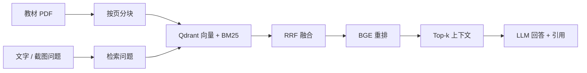

# 医学影像教材 RAG

[](https://github.com/YhxMo/medical-rag/actions/workflows/tests.yml)
[English](README.md) · [架构说明](docs/architecture.md) · [检索评测](docs/evaluation.md) · [评测与调参记录](experiments/README.md)

一个面向教材学习的 RAG 项目。输入文字问题或教材截图，检索相关内容，生成带编号引用的回答，并展示教材文件名、PDF 页码和原文。

## 核心流程



- **混合检索**：BGE ONNX 向量召回与 BM25 关键词召回，RRF 融合后用 Cross-Encoder 重排。
- **来源溯源**：分块保留教材名、PDF 页码和字符位置，回答引用对应本次检索结果。
- **截图提问**：视觉模型把截图转成检索问题，结合截图与教材证据回答；英文教材支持中文问题转换。
- **可选图像入库**：显式启用后，为含位图的 PDF 页面生成描述，和文本使用同一索引。
- **单一查询实现**：CLI 和 Gradio 共用 `QueryService`；离线模式沿用同一检索链路，直接展示原文。

## 快速运行

需要 Python 3.12 和 [uv](https://docs.astral.sh/uv/)。

```bash
uv sync --extra dev --locked

# 自编小语料 + 确定性向量：不下载模型，不调用 API
uv run python scripts/demo.py
uv run python scripts/demo.py --serve
```

演示用于验证软件流程；其中的哈希向量不代表真实语义检索效果。

## 使用自己的教材

```bash
cp config.example.yaml config.yaml
mkdir -p data/raw
# 将可提取文字的 PDF 放入 data/raw/

uv run medical-rag index
uv run medical-rag query 'What determines axial resolution in ultrasound?' --offline
uv run medical-rag serve
```

首次建库会下载配置的 embedding 模型；首次重排会下载配置的 reranker。已有本地模型时可在 `config.yaml` 中配置路径。Qdrant 使用本地模式，无需另起服务；同一索引请勿同时建库和启动多个查询进程。

生成回答前，在当前终端设置 `DEEPSEEK_API_KEY`；截图提问和图像描述入库还需 `DASHSCOPE_API_KEY`。模型、兼容 API 地址均可在配置中修改。网页默认勾选“仅检索教材原文”，取消后才调用模型。

```bash
uv run medical-rag query '超声的轴向分辨率由什么决定？'
uv run medical-rag query '解释这张教材图' --image /path/to/screenshot.png

# 可选：每个含位图的 PDF 页面调用一次视觉 API，再重建索引
uv run medical-rag index --captions
```

每次 `index` 都重建当前配置对应的索引。仅文本建库会替换先前含图像描述的索引。配置中的文件路径相对于配置文件解析；`--image`、评测数据集等命令行路径相对于当前目录。

## 目录

```text
src/
  document/       PDF 解析、分块、可选图像描述入库
  embedding/      FastEmbed；离线演示用的哈希向量
  indexer/        Qdrant、BM25 与 RRF
  reranker/       BGE Cross-Encoder
  application/    依赖组装、模型客户端、提示词、统一查询服务
  evaluation/     标注数据读取与检索指标
  ui/             Gradio 界面
  config/         YAML 与环境变量解析
  cli.py          index / query / serve / evaluate
  schema.py       页面、证据与检索结果
scripts/demo.py   无 API 的端到端演示
```

## 评测与调参过程

[experiments/](experiments/README.md) 保留了历次实验配置、冻结题集、逐题中间结果、失败案例和调参结论，包括混合检索基线、章节增强、BGE 重排、上下文扩展以及多模态回答对照。

在 10 道标注文本题的检索对照实验中，相比混合检索基线，章节信息 + BGE 重排方案的 Recall@5 从 0.80 提升至 0.90，P95 从 0.38 s 增至 1.85 s。实验展示了召回效果与延迟的取舍；参数和测量条件见[原始记录](experiments/docs/resume-v2/retrieval_development.json)。

## 验证与边界

```bash
uv run pytest -q
uv run ruff check src tests scripts
uv run medical-rag evaluate /path/to/questions.json --output experiments/runs/baseline.json
```

评测计算 Recall@k、Precision@k、MRR、NDCG@k。数据格式和指标定义见[评测文档](docs/evaluation.md)。

项目用于教材学习，不用于患者诊断。引用编号检查只验证编号合法性，不证明答案被原文支持。默认只处理 PDF 文本；可选视觉描述覆盖含位图页面，不包含通用 OCR、纯矢量图识别或表格结构重建。教材、模型权重、索引和密钥均不随仓库分发。
