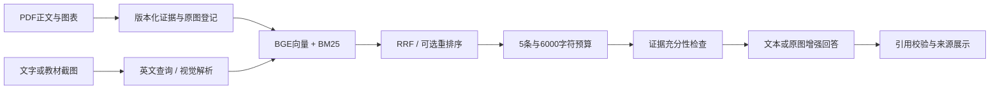

# 医学影像教材学习助手

[English](README.md) · [安装、演示与完整实验流程](docs/resume-v2/README.md) · [当前验收状态](docs/resume-v2/status.json)

面向教材学习的 RAG 项目：**混合检索、教材图文证据、截图提问、来源引用与可追溯评测**。不是患者影像诊断系统。

## 当前版本

- 基础语料为三份英文官方教材，共 **2,809 条文本证据**。
- **60 个图表页**已完成真实视觉描述和入库，每本教材 20 页；两套独立图文索引各含 **2,869 条证据**，保留原图、页码、章节信息及内容摘要。
- 检索采用本地 BGE／ONNX、Qdrant、BM25、RRF。10 道开发集文本任务上，重排序使标注 Recall@5 从 **0.80 到 0.90**、NDCG@5 从 **0.706 到 0.755**，检索 P95 约 **1.85 秒**；已据此冻结默认策略。这是小样本检索结果，不是回答准确率。
- **80 道 AI 候选题已冻结**，按来源分为开发／留出各 40 道；来源核验和评分复核均明确标记 AI，人工审核数为 0。
- CLI 与 Gradio 共用问答服务；支持中文检索表达转换、截图解析、原图回答、引用编号检查和证据不足状态。
- 提供模型输入版本校验、断点缓存、统一 30 元费用上限与离线测试。

**当前哪些能力已实际运行、哪些仍待模型服务验收，以状态文件为准。新版本不沿用旧版 100% 检索成绩，也不将代码实现写成已验证的多模态收益。**

## 快速使用

准备 Python 3.12、依赖、三份原文及本地模型，步骤见[复现说明](docs/resume-v2/README.md)。

```bash
python -m pytest -q -p no:cacheprovider --tb=short
python scripts/build_resume_v2.py --mode text
python -m src.cli query 'What determines axial resolution in ultrasound?' --config config.resume-v2.yaml --json
python -m src.cli serve --config config.resume-v2.yaml
```

新机器需要先取得清单中的原文并构建公开语料基础索引；克隆仓库不包含教材、模型和生成数据。在线多模态需要本机配置 DeepSeek 与百炼密钥。无回显输入与续跑命令见复现说明。

## 架构



## 结果表述

见[验收记录](docs/resume-v2/status.json)。模型评分是代理指标；不等于医学准确率、人工标注或临床安全验证。

旧四本中文教材的多模态索引、旧口径评测及旧安装说明保留在[历史中文说明](docs/history/README.pre-resume-v2.zh-CN.md)。既有公开语料实验见[历史实验记录](docs/evaluation/improvement_experiment_v1.md)。
